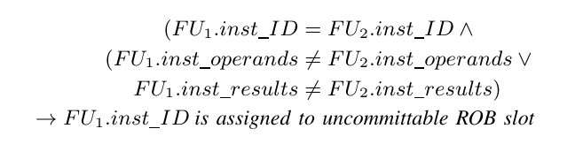

# upec-boom-verification-suite
This repository contains the verification suite to verify the *Berkeley Out-of-Order Machine (BOOM)* microarchitecture design against transient execution side-channel attacks (e.g., Spectre, Meltdown, MDS Attack). The verification suite is based on the Unique Program Execution Checking (UPEC), a formal HW security verification technique targeting microarchitectural vulnerabilities. The method is developed at the [chair of electronic design automation](https://www.eit.uni-kl.de/eis/) at Technische Universität Kaiserslautern (TUKL).   

The verification suite verifies a design variant of BOOM based on the generated Verilog code at the Register Transfer Level (RTL). The verification environment is based on OneSpin 360 DV, however, the underlying method is tool-agnostic, meaning the property and proof script can be easily adapted to different commercial formal verification tools.   

It should be noted that UPEC is a hardware verification technique and verifies a concrete RTL model of the system against transient execution attacks, by exploring any possible software/firmware for the system. This is different
than software verification techniques that verify a specific SW by making certain assumptions about the underlying microarchitecture.   

A more detailed description of the employed formal verification technique can be found in:

[1] Fadiheh, M. R., Stoffel, D., Barrett, C., Mitra, S., & Kunz, W. (2019, March). Processor hardware security vulnerabilities and their detection by unique program execution checking. In 2019 Design, Automation & Test in Europe Conference & Exhibition (DATE) (pp. 994-999). IEEE.

[2] Rahmani Fadiheh, M., Stoffel, D., Barrett, C., Mitra, S., & Kunz, W. (2018). Processor Hardware Security Vulnerabilities and their Detection by Unique Program Execution Checking. arXiv e-prints, arXiv-1812.
([Link](https://arxiv.org/pdf/1812.04975.pdf))

[3]Fadiheh, M. R., Müller, J., Brinkmann, R., Mitra, S., Stoffel, D., & Kunz, W. (2020, July). A formal approach for detecting vulnerabilities to transient execution attacks in out-of-order processors. In 2020 57th ACM/IEEE Design Automation Conference (DAC) (pp. 1-6). IEEE.

## Basic Idea
The basic idea of UPEC is to check if a set of confidential information, in short the secret, can have a subtle effect on the way a program executes. This is formalized in the notion of unique program execution.  A program executes uniquely w.r.t. a secret if and only if the sequence of valuations to the set of program visible state variables is independent of the value of the secret, in every clock cycle of program execution. In other words, UPEC checks for variations of behavior that are visible in the microarchitecture (also called “microarchitectural footprint”) but not at the ISA level.

UPEC verifies this requirement by checking a 2-safety property (= a property that relates to 2 execution traces rather than one) on a tailor-made miter model (Fig. 1). In this model, the two CPU instances execute the same program, since the two memories must have the same content. This content is not specified so that the CPUs can execute any program. The only difference between the two instances can be in the protected memory location hosting the secret. Based on this model, assuming both CPUs start from the same initial state, we check if the secret data lead to different executions in the two instances for any program.

|  |
|:--:|
| *Figure 1: UPEC Miter* |

## General OOO Processor Model

To reason about the UPEC proof for an OOO processor, we need to define an abstract model for such processors. This model will be used to prune the state space explored in UPEC by removing unreachable sub-spaces violating rules of out-of-order execution.

The abstract OOO-processor model consists of 1) different functional units (FU) and sets of buffers for in-flight instructions (*pipeline bookkeeping buffers*), 2) a reorder buffer (ROB) which ensures that the instructions commit in program order, and 3) a prediction unit (PU) which resolves the outstanding speculations in the pipeline by determining correct and incorrect predictions.

Every instruction in the pipeline (in the ROB or pipeline bookkeeping buffers) has two identifiers:

+ ID of the assigned ROB Slot (ROB ID): A unique identifier that reflects the program order.
+ Speculation tag: An identifier that reflects the level of speculation, i.e., the number of unresolved branches before the instruction. It should be noted that to support nested speculation, there must be an ordering between the speculation tags, so that misprediction on an earlier branch discard also all the subsequent branches. Encoding of the order of the tags is implementation-specific.

Branches and other instructions which can initiate speculation (*SPI instructions*), have another identifier, called *spawn tag*. The spawn tag of an SPI instruction determines the speculation tag of the instructions that are dispatched after the considered SPI instruction. The prediction unit uses the spawn tag of the executed branch instruction to resolve the outstanding speculative instructions.

## Microequivalence
The UPEC proof is an unbounded proof based on an unrolled circuit model with a symbolic initial state. The symbolic initial state enables the solver to explore all possible program contexts implicitly, and it is the contributing factor to achieve a conclusive proof result at the end. However, a symbolic initial state overapproximates the reachable state set of the system and may lead to spurious counterexamples. For processors of medium complexity with in-order pipelining, the miter construction of Fig. 1 ensures that only little effort is required for manually creating invariants to eliminate spurious counterexamples. However, this changes drastically when out-of-order processors are considered. The symbolic initial state can then include
starting states, for example with inconsistent instruction identifiers across the pipeline, so that invalid execution orders are considered. As a result, secret-dependent microarchitectural observations can be generated which are spurious counterexamples to the UPEC property.

To address this issue, instead of engaging in a tedious process of modeling all relevant functional behaviors by assertions (invariants), the proof is constrained by a new invariant, which we call Microequivalence. Microequivalence (conservatively) over-approximates correct Out-of-Order execution behavior of the processor in terms of certain data structures used in the bookkeeping mechanisms of OOO-execution.

Fig. 2 shows a general model of how instructions execute in a transient execution attack. The program does not depend on the secret from the ISA level point of view, thus there must be no instruction in the main sequence that depends on the secret. However, instructions in the transient sequence (in a Spectre-style attack these typically belong to a privileged process called by the attacker) can access the secret but cannot commit. In the following, we assume that the transient instructions are discarded due to a misprediction event. For the case that an exception discards the transient instructions the approach is analogous.

|  |
|:--:|
| *Figure 2: General model for transient execution attack: microarchitectural flow* |

For information leakage to happen, the transient sequence must affect the behavior of the main sequence. Consequently, a spurious behavior (due to invalid execution order) can only lead to a false counterexample to the UPEC proof if it creates a false interrelation between the transient and the main sequence (e.g., the secret value being forwarded from the transient sequence to the main sequence). Due to the UPEC miter structure, any spurious behavior within each block is irrelevant for the proof. This means that the bookkeeping mechanisms must be constrained to ensure the program order only between the three code blocks in Fig. 2, but not necessarily within each block. This observation is key and allows us to approximate microequivalence effectively in terms of tag and ID consistency, and by a partitioning of the ROB into a committable and uncommittable part, as will be elaborated in the following.

In the following, the ROB ID of the last instruction in the main sequence is denoted by root\_ID. The ROB is partitioned into two sets:

**Committable set:** ROB slots with an ID that is before the root\_ID, i.e., ROB IDs which are between ROB head and root\_ID. Instructions in these slots will commit their results.

**Uncommittable set:** ROB slots with an ID that is after the root\_ID, i.e., ROB IDs which are not between ROB head and root\_ID. Instructions in these slots are transient and are not allowed to commit their results. They are invalidated when the misprediction signal is asserted.

|  |
|:--:|
| *Figure 3: Partitioning the ROB* |

Based on the partitioning of the ROB, we describe three sets of assumptions that together create an over-approximation of the microequivalence requirement which does not restrict the generality of the proof. They are denoted in the following by ME-1, ME-2,. . . , ME-6. A template for these assumptions is provided in  [Documentation/UPEC_OOO_Template.v](https://github.com/mofadiheh/upec-boom-verification-suite/blob/main/Documentation/UPEC_OOO_Template.v), which can be used to develop the UPEC property for any OOO processor.

### ROB Consistency:
The bookkeeping mechanism must be constrained to prevent spurious behaviors in speculative execution scenarios, in which instructions commit before speculation resolution. The following set of assumptions prevents the occurrence of spurious counterexamples in which instructions in the uncommittable ROB slots commit their results.

##### ME-1 (Root Instruction Pending):
*(i) The ROB slot with root ID contains an SPI instruction.*
*(ii) The SPI is mispredicted and*
*(iii) it remains valid (pending) until its misprediction is signaled by the prediction unit.*

Note that this condition restricts the search of the solvers to instruction sequences containing transient executions which are the root cause of the attacks targeted by UPEC. This bound on the search space contributes significantly to the tractability of UPEC.

##### ME-2 (Uncommittable Slots Invalidated):
*In the clock cycle following the misprediction of the SPI with root ID, every valid ROB slot in the uncommittable set is invalidated.*

ROB tail is critical for maintaining relevant information on program order. A newly fetched instruction is assigned to the ROB tail slot and its speculation tag is determined by the latest branch instruction. In a functionally correct design, if the latest instruction belongs to the uncommittable set, then the ROB tail must also point to a slot in the uncommittable set. If this condition is violated in the symbolic initial state, this can create a spurious scenario in which a branch in the transient sequence can control instructions in the main sequence.

##### ME-3 (ROB tail Consistency):
*Until misprediction, ROB tail points to an uncommittable ROB slot.*

Note that, for our purposes, it does not matter which of the uncommittable ROB slots exactly ROB tail points to. This strongly simplifies the specification of ME-3.

### Functional Unit Consistency:
Due to our assumption that the program does not depend on the secret from the ISA level point of view, the two SoC instances in the UPEC miter are not allowed to commit different values. (The only difference can be the time point of the commit.) Consequently, the instructions in the committable ROB slots must always produce the same results. We must prevent spurious counterexamples that violate this condition. Instead of specifying the details of a correct data hazard handling and operand forwarding as an invariant, it is sufficient to formulate the following assumption for every functional unit.

##### ME-4 (FU Consistency):

This is based on the observation that the same instruction on the same FU can only have different operands and/or results if the secret has propagated to this FU. This can only occur in transient executions and the instruction must be assigned to the uncommittable set.

### Speculation Consistency:
Secret-dependent SPIs can occur within the transient sequence. Their misprediction must not lead to discarding instructions of the main sequence. If the initial state violates this condition due to tag inconsistency this produces a false counterexample in which one CPU instance commits an instruction while the other one does not.
To address this issue we need to identify the spawn tag of the instruction at root\_ID (T\_main). In a functionally correct OOO execution, all the instructions in the transient sequence must have a speculation tag that is equal to T\_main or below T\_main.

To avoid false counterexamples, we need to make sure that all uncommittable instructions have a speculation tag that is equal or below T\_main, i.e., once the misprediction for T\_main happens, all uncommittable instructions in the pipeline will be discarded.

##### ME-5 (Consistent Speculation Tag):
*Every in-flight instruction with ROB ID in the uncommittable set must have a speculation tag equal to or below T\_main.*

Since nested speculation is possible in most OOO processors, it is important to ensure that the spawn tags of SPI instructions within the transient sequence maintain the program order. The goal is to avoid scenarios in which misprediction of a transient branch leads to discarding an instruction in the main sequence which is a clear violation of the program order.

We address this issue by partitioning the set of all speculation tags into two sets of committable and uncommittable tags. This is achieved by first identifying all the committable and uncommittable instructions in the ROB and pipeline bookkeeping buffers and then assigning the speculation tag of committable instructions to the committable tags set and the speculation tag of uncommittable instructions to the uncommittable tags set.

Based on this partitioning we make sure that the uncommittable SPI instructions do not spawn tags within the set of committable tags.

##### ME-6 (Consistent Spawn Tag):
*The spawn tag of every in-flight SPI instruction with ROB ID in the uncommittable set must not be equal to or above (according to program order) any of the tags in the committable tags set.*

Implementing these conditions in a property language is straight-forward and only involves identifying the buffers containing tags and IDs of in-flight instructions. A template for applying UPEC to out-of-order processors using microequivalence is available in [Documentation/UPEC_OOO_Template.v](https://github.com/mofadiheh/upec-boom-verification-suite/blob/main/Documentation/UPEC_OOO_Template.v). It is used as a basis for developing the BOOM Verification suite.

## BOOM
The Berkeley Out-of-Order Machine (BOOM) is a synthesizable and parameterizable open-source RISC-V out-of-order core written in the Chisel hardware construction language and is developed by the UC Berkeley Architecture Research group.  
The documentation for BOOM can be found here : [https://docs.boom-core.org/en/latest/index.html](https://docs.boom-core.org/en/latest/index.html)

## Microequivalence for BOOM
In our experiment, the Verilog code for the design was generated using the medium performance configuration (MediumBoomConfig). In this configuration, the core can issue two instructions per clock cycle and the reorder buffer (ROB) consists of two banks each holding up to 32 entries. The core has two prediction units that compute if the branch predictions were correct.

Each instruction also has a 12-bit speculation tag (in BOOM it is called branch mask (br\_mask) ), that specifies on which preceding branch instructions this instruction depends. Each set bit in the branch mask represents a dependency to the branch with the level of speculation corresponding to the position of the bit. This means if a branch resolves as mispredicted all instructions that have the corresponding bit in their branch mask set, need to be discarded. If a branch resolves as correctly predicted the bit can simply be cleared.  

In the following, more concrete information is provided on how to specify ME-5 and ME-6 in particular for the BOOM microarchitecture.

### ME-5 and ME-6
In order to construct the committable and uncommittable tag sets, first, it is necessary to identify **all** bookkeeping buffers in the pipeline.
Each of these buffers holds a speculation tag (branch mask) as well as a ROB ID or a pointer to an entry in the load/store queue in which the corresponding ROB ID can be found.

For ME-5, we only need to compute the intersection of all the uncommittable tags. Thus, the speculation tags (branch masks) of all uncommittable instructions in the pipeline bookkeeping buffers are ANDed together to compute the set of uncommittable tags. For all the buffers which hold a committable instruction, a don't care value is considered (12'hfff).

For ME-6, we need to consider the union of all committable tags. Thus, the speculation tags (branch masks) of all committable instructions in the pipeline bookkeeping buffers are ORed together to compute the set of committable tags. For all the buffers which hold an uncommittable instruction, a don't care value is considered (12'h000).

For ME-5 to hold, the bitwise conjunction of the uncommittable tags and the T\_main must be equal to T\_main. This means that all instructions in the uncommittable set must have a speculation level below the speculation level of the instruction at root\_id.

For ME-6 to hold, we need to check for every branch resolution of the prediction unit, if the branch is an uncommittable instruction, the bitwise disjunction between its spawn tag and the committable tags must be zero. This means that misprediction of this branch will not affect any of the committable instructions.

## How to run the code
For the experiment, we used the OneSpin 360 DV verification tool. After starting OneSpin the following commands need to be executed in the OneSpin shell:
> source run.tcl    
> source pure_ipc.tcl

It should be noted that the property will fail since the design is vulnerable to different variants of the Spectre Attack.

## Repository Structure
The folders in this repository contain the following files:  
- **Documentation:**    
This folder contains the UPEC_OOO_Template.v that can be used to apply the UPEC methodology to other OOO cores. Also the figures for the README.md can be found here.
- **Properties:**   
This folder contains the UPEC property (upec_checker.vli) and all its components as for example the macro for the state equivalence.
- **RTL:**   
This folder contains all Verilog files as for example the BOOM design and also the miter circuit that is used as top module in the UPEC proof.
- **Repository root folder:**   
This folder contains the other folders, the README.md and the .tcl scripts to run the experiment with the OneSpin 360 DV tool.
