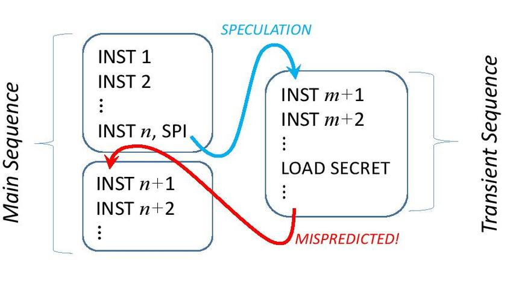
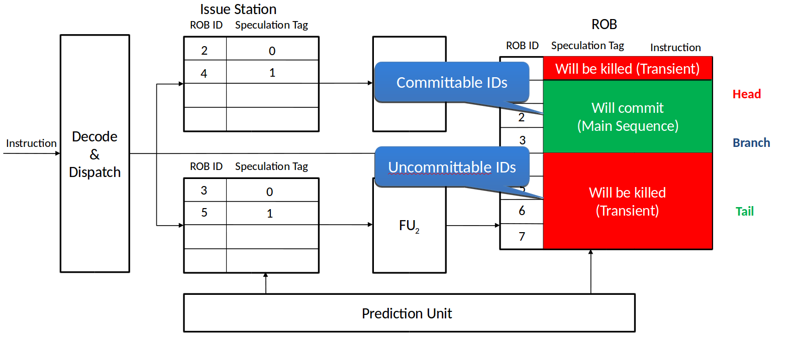

# upec-boom-verification-suite
This repository contains the verification suite to verify the Berkeley Out-of-Order Machine (BOOM) michroarchitecture design against transient execution side channesl attacks (e.g., Spectre, Meltdown, MDS Attack). The verification suite is based on the Unique Program Execution Checking (UPEC), a formal HW security verification technique targeting microarchtectural vulnerabilities. The method is developed at the [chair of electronic design automation](https://www.eit.uni-kl.de/eis/) at Technische Universität Kaiserslautern (TUKL).   

The verification suite verifies a design variant of BOOM based on the generated verilog code. The properties and the verification environment for this verification suite is based on OneSpin 360 DV, however, the underlying method is tool-agnostic, meaning the property and proof script can be easily adapted to different commercial formal verification tools.   

It should be noted that UPEC is a hardware verification technique and verifies a concrete RTL model of the system against transient execution attacks, by exploring any possible software/firmware for the system. This is different
than software verification techniques which verify a specific SW by making certain assumptions about the underlying microarchitecture.   

For more detailed description of the employed formal verification technique, please refer to DATE paper, ArXiv,  DAC paper.

## Basic Idea
The basic idea of UPEC is to check if a set of confidential information, in short the secret, can have a subtle effect on the way a program executes. This is formalized in the notion of unique program execution.  A program executes uniquely w.r.t. a secret if and only if the sequence of valuations to the set of program visible state variables is independent of the value of the secret, in every clock cycle of program execution. In other words, UPEC checks for variations of behavior that are visible in the microarchitecture (also called “microarchitectural footprint”) but not at the ISA level.

UPEC verifies this requirement by checking a 2-safety property (= a property that relates to 2 execution traces rather than one) on a tailor-made miter model (Fig. 1). In this model, the two CPUs execute the exact same program, since the two memories must have the same content. This content is not specified so that the CPUs can execute any program. The only difference between the two instances can be in the protected memory location hosting the secret. Based on this model we check, assuming both CPUs start from the same initial state, if the secret data lead to different executions in the two instances for any program.

## Microequivalence
The UPEC proof is an unbounded proof based on an unrolled circuit model with symbolic initial state. The symbolic initial state enables the solver to explore all possible program contexts implicitly, and it is the contributing factor to achieve a conclusive proof result at the end. However, this symbolic intial state overapproximates the reachable state set of the system and leads to spurious counterexamples, which are violating the program order. 

To address this issue, the proof is constrained by a new invariant, which we call microequivalence. Microequivalence is based on the idea

Instead of engaging into a tedious process of modeling all relevant functional behaviors by assertions (invariants), we (conservatively) over-approximate microequivalence in terms of certain data structures used in the bookkeeping mechanisms of OOO-execution, as introduced by the processor model of the previous section. Fig. 2 shows a general model of how instructions execute in a transient execution attack. Since the program must have a secret-independent architectural observation, there must be no instruction in the main sequence that depends on the secret. However, instructions in the transient sequence (in a Spectre-style attack these typically belong to a privileged process called by the attacker) can access the secret but cannot commit. In the following, we assume that the transient instructions are discarded due to a misprediction event. For the case that an exception discards the transient instructions the approach is analogous.

For information leakage to happen, the transient sequence must affect the behavior of the main sequence. Consequently, a spurious behavior (due to invalid execution order) can only lead to a false counterexample to the UPEC proof if it creates a false interrelation between the transient and the main sequence (e.g., secret value being forwarded from the transient sequence to the main sequence). Due to the UPEC miter structure, any spurious behavior within each block is irrelevant for the proof. This means that the bookkeeping mechanisms (ROB, PU, FU instruction IDs) must be constrained to ensure the
program order only between the three code blocks in Fig. 4, but not necessarily within each block. This observation is key and allows us to approximate microequivalence effectively in terms of tag and ID consistency, and by a partitioning of the ROB into a committable and uncommittable part, as will be elaborated in the following.

In the following, the ROB ID of the highest mispredicted SPI in the hierarchy, SPI instn in Fig. 4, is denoted by root\_ID. The ROB is partitioned into two sets:

Committable set: ROB slots with an ID that is before the root\_ID, i.e., ROB IDs which are between ROB head and root\_ID. Instructions in these slots can commit their results.

Uncommittable set: ROB slots with an ID that is after the root\_ID, i.e., ROB IDs which are not between ROB head and root\_ID. Instructions in these slots cannot commit their results. They are invalidated when the misprediction signal is asserted.

Based on the partitioning of the ROB, we describe three sets of assumptions which together create an over-approximation of the microequivalence requirement which does not restrict the generality of the proof. They are denoted in the following by ME-1, ME-2,. . . , ME-6.

### ROB Consistency:
The bookkeeping mechanism must be constrained to prevent spurious behaviors in speculative execution scenarios, in which instructions commit before speculation resolution. The following set of assumptions prevents occurrence of spurious counterexamples in which instructions in the uncommittable ROB slots commit their results.

##### ME-1 (Root Instruction Pending):
*(i) The ROB slot with root ID contains an SPI instruction.*
*(ii) The SPI is mispredicted and*
*(iii) it remains valid (pending) until its misprediction is signaled by the prediction unit.*

Note that this condition restricts the search of the solvers to instruction sequences containing transient executions which are the root cause of the attacks targeted by UPEC. This bound on the search space contributes significantly to the tractability of UPEC. A condition similar to ME-1 is formulated for the case that transient executions are terminated by an exception, and is omitted here for reasons of space.

##### ME-2 (Uncommittable Slots Invalidated):
*In the clock cycle following the misprediction of the SPI with root ID, every valid ROB slot in the uncommittable set is invalidated.*

Also ROB tail is critical for maintaining relevant information on program order. A newly fetched instruction is assigned to the ROB tail slot and its speculation tag is determined by the latest branch instruction. In a functionally correct design, if the latest instruction belongs to the uncommittable set, then ROB tail must also point to a slot in the uncommittable set. If this condition is violated in the symbolic initial state, this can create a spurious scenario in which a branch in the transient sequence can control an instruction in the main sequence.

##### ME-3 (ROB tail Consistency):
*Until misprediction, ROB tail points to an uncommittable ROB slot.*

Note that, for our purposes, it does not matter which of the uncommittable ROB slots exactly ROB tail points to. This strongly simplifies the specification of ME-3.

### Functional Unit Consistency:
Due to our assumption that the program must have a secret-independent architectural observation (cf. Sec. III), the two SoC instances in the UPEC miter are not allowed to commit different values. (The only difference can be the time point of commit.) Consequently, the instructions in the committable ROB slots must always produce the same results. We must prevent spurious counterexamples that violate this condition. Instead of specifying the details of a correct data hazard handling
and operand forwarding as an invariant, it is sufficient to formulate the following assumption for every functional unit.

##### ME-4 (FU Consistency):

This is based on the observation that the same instruction on the same FU can only have different operands and/or results if the secret has propagated to this FU. Since we are not targeting functional leakage at the SW level, this can only occur in transient executions and the instruction must be assigned to the uncommittable set.

### Speculation Consistency: 
Secret-dependent SPIs can occur within the transient sequence. Their misprediction must not lead to discarding instructions of the main sequence. If the initial state violates this condition due to tag inconsistency this produces a false counterexample in which one CPU instance commits an instruction while the other one does not.
We address this issue by identifying the tag T\_main which is the highest tag (by its integer number) of the main sequence, i.e., the highest tag of instructions in the committable set. For T\_main to be useful in the following, we need to make sure that spurious initial states are excluded from consideration where instructions of the uncommittable set have tags smaller than or equal to T\_main.

##### ME-5 (Consistent Speculation Tag):
*Every in-flight instruction with ROB ID in the uncommittable set must have a speculation tag greater than T\_main.*
Based on a T\_main fulfilling ME-5, we can ensure that counterexamples are generated such that SPIs in the transient sequence only spawn tags which are greater that T\_main .

##### ME-6 (Consistent Spawn Tag):

Implementing these conditions in a property language is straight-forward and only involves identifying the buffers containing tags and IDs of in-flight instructions.

A template for applying UPEC to out-of-order processors using microequivalence is available in the documentation folder(UPEC\_OOO\_Template.v). It is used as a basis for developing the BOOM Verification suite. 

## BOOM
The Berkeley Out-of-Order Machine (BOOM) is a synthesizable and parameterizable open-source RISC-V out-of-order core written in the Chisel hardware construction language and is developed by the UC Berkeley Architecture Research group.  
The documentation for BOOM can be found here : [https://docs.boom-core.org/en/latest/index.html](https://docs.boom-core.org/en/latest/index.html)

## Microequivalence for BOOM
In our experiment we use the MediumBoomConfig to generate the core. In this configuration the core can issue two instructions per clock cycle and the reorder buffer(ROB) consists of two banks each holding up to 32 entries. The core has two branch units that compute if the branch predictions were correct.  
Every instruction has a 4-bit branch tag (br\_tag) that specifies the level of speculation the instruction will create, in case if it is a speculation initiating (SPI) instruction.   
Each instruction also has a 12-bit branch mask (br\_mask), that specifies on which preceding branch instructions this instruction depends. Each set bit in the branch mask represents a dependency to the branch with the level of speculation corresponding to the position of the bit. This means, if a branch resolves as mispredicted all instructions that have the corresponding bit in their branch mask set, need to be discarded. If a branch resolves as correctly predicted the bit can simply be cleared.   
Since most of the microequivalence constraints can be implemented exactly as explained in the given template, we focus on the needed adjustments for BOOM:   
### ME-1
If the branch instruction at root\_id is pending, its busy and valid bits must be set.

### ME-2
After misprediction of the instruction at root\_id it is necessary to check, for both ROB banks, if each instruction is either in the committable set or it is invalidated.

### ME-3
Since the ROB can only commit exactly two instructions at the same time, the ROB row needs to be checked.

### ME-4
Exactly as in the template.

### ME-5 and ME-6
First it is necessary to find **all** buffers in the pipeline that can hold an instruction. For every buffer we create a wire for the commitable mask and the uncommittable mask. Then for all these buffers it is necessary to determine if they hold an instruction in the committable or uncommittable set of the ROB using the ROB ID of the instruction.   
If the instruction is in the committable set, its branch mask is stored in the wire for the committable mask and the wire for the uncommittable mask is set to 12'hfff.   
If the instruction is in the uncommittable set, its branch mask is stored in the wire for the uncommittable mask and the wire for the committable mask is set to 12'h0.   
Some buffers do not store the ROB ID of the instruction, but they have a flag indicating that they used the load or store queue and the according index in that queue. Therefore it is necessary to obtain the ROB ID of these instruction from the load or store queue.   
After all wires are assigned, all commitable masks are combined using the bitwise OR-operator and all uncommittable masks are combined using the bitwise AND-operator.   
For ME-5 to hold, the bitwise conjunction of the uncommittable masks and the branch mask of root\_id must be equal to the branch mask of root\_id. This means that all instructions in the uncommittable set must have a speculation level below the speculation level of the instruction at root\_id.   
For ME-6 to hold, we need to check for every mispredicting instruction that is not in the committable set, if its spawn tag is greater than the bitwise disjunction of the committable masks.   

## How to run the code
For the experiment we used the OneSpin 360 verification tool. After starting OneSpin the following commands need to be executed in the OneSpin shell:
> source run.tcl    
> source pure_ipc.tcl

Then the property can be checked and it will fail, since the design is not secure.
